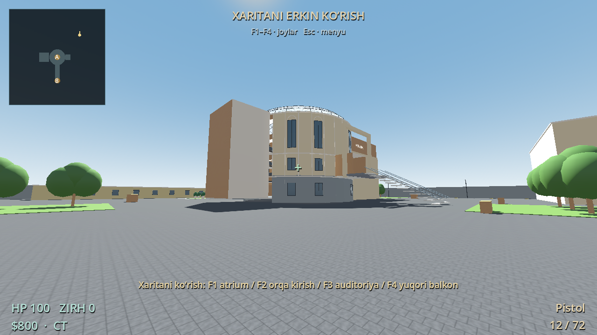

# Atrium Strike

CS 1.6 uslubidan ilhomlangan, **Windows va Linux uchun botlar bilan o‘ynaladigan mustaqil FPS**. Xarita foydalanuvchi yuborgan `IMG_0038.MOV`–`IMG_0052.MOV` videolariga asoslangan. Bu dastlabki o‘ynaladigan versiya; original Counter-Strike kodi, modellari va tovushlari ishlatilmagan.

## Tayyor Windows o‘yini

**[AtriumStrike-Windows-x64.zip ni yuklab olish](https://github.com/azimbekcode/csgame/raw/refs/heads/main/downloads/AtriumStrike-Windows-x64.zip)**

ZIP’ni to‘liq oching, `AtriumStrike/AtriumStrike.exe` ni ishga tushiring. Godot o‘rnatish, internet yoki administrator huquqi kerak emas. Windows 10/11 x64 va OpenGL 3.3’ni qo‘llaydigan video drayver talab qilinadi. Bu portable EXE; APK Android uchun va bu versiyaga kiritilmagan. Faylning SHA-256 qiymati [SHA256SUMS.txt](downloads/SHA256SUMS.txt) da.

Windows SmartScreen noma’lum ilova haqida ogohlantirishi mumkin: EXE raqamli sertifikat bilan imzolanmagan. Faylni yuqoridagi repozitoriydan yuklagan bo‘lsangiz, **Подробнее → Выполнить в любом случае** orqali ochishingiz mumkin.

## Tayyor Linux o‘yini

**[AtriumStrike-Linux-x64.zip ni yuklab olish](https://github.com/azimbekcode/csgame/raw/refs/heads/main/downloads/AtriumStrike-Linux-x64.zip)**

ZIP’ni to‘liq oching, `AtriumStrike` papkasida terminal ochib bajaring:

```bash
chmod +x AtriumStrike.x86_64
./AtriumStrike.x86_64
```

Godot yoki Wine kerak emas. Yangilangan Kali Linux x64, Debian yoki Ubuntu, grafik ish stoli va OpenGL 3.3 video drayver talab qilinadi. ARM uchun mos emas. Batafsil: [Linux yo‘riqnomasi](docs/LINUX.txt).

Menyuda **CT bilan boshlash**, **T bilan boshlash** yoki **Xaritani erkin ko‘rish**ni tanlang. Bot qiyinligi, ovoz, sichqoncha sezgirligi va to‘liq ekran sozlamalari saqlanadi.


## O‘yin

- Siz va 7 bot: 4×4 jamoalar, 5 raund g‘alabasigacha.
- CT/T, 5 soniya tayyorgarlik, 115 soniya raund, A/B bomba nuqtalari.
- T bomba o‘rnatadi; CT zararsizlantiradi. Bomba 35 soniyadan keyin portlaydi.
- Pistol, AK-47, M4, MP5, sniper, shotgun va pichoq. O‘q zaxirasi, qayta o‘qlash, tarqalish, recoil, headshot va sniper zoom mavjud.
- HE, flash va smoke granatalari. Devorga urilish va ko‘rish chizig‘i hisobga olinadi; smoke botlarning ko‘rishini to‘sadi.
- HP, zirh, defuse kit, xarid, kill puli, raund iqtisodi, hisob, minimap va kill feed.
- Botlar navigatsiya, ko‘rish chizig‘i, otish, qayta o‘qlash, bomba o‘rnatish va zararsizlantirishdan foydalanadi.
- O‘lgan o‘yinchi keyingi raundda qaytadi. Friendly fire o‘chirilgan. Internet multiplayer bu versiyada yo‘q.


## Boshqaruv

| Tugma | Amal |
| --- | --- |
| WASD / sichqoncha | Yurish / qarash |
| Space / Ctrl / Shift | Sakrash / egilish / sekin yurish |
| Chap sichqoncha tugmasi | Otish yoki granata uloqtirish |
| O‘ng sichqoncha tugmasi | Sniper zoom |
| 1 / 2 / 3 / 4 | Asosiy qurol / pistol / pichoq / granata turini almashtirish |
| R / B | Qayta o‘qlash / xarid |
| E | Bomba o‘rnatish yoki zararsizlantirish |
| Tab / Esc / F11 | Hisob / pauza / to‘liq ekran |
| F1–F4, erkin ko‘rishda | Atrium / orqa kirish / auditoriya / yuqori balkon |

Birinchi raund $800 va pistol bilan boshlanadi. **B** bilan dastlabki 20 soniyada, boshlanish joyidan 12 metr ichida xarid qilish mumkin. T: A yoki B nuqtada qimirlamasdan **E**’ni 3 soniya tuting. CT: bomba yonida **E**’ni 10 soniya tuting; kit bilan 5 soniya.

## Video asosidagi xarita

Ichki qism: yog‘och panelli dumaloq atrium, uchta yuqori balkon, metall va qoramtir shisha panjaralar, shisha gumbaz, qavatlararo zinapoyalar, pog‘onali auditoriya, partalar, minbar, ekran, orqa yo‘lak, sariq taktil yo‘lak va shisha kirish.

Tashqi qism: och rangli dumaloq fasad, uzun yuqori derazalar, ko‘tarilgan old kirish, tashqi zinapoyalar, orqa ayvon va ustunlar, hovli, xizmat binosi, yon binolar, bog‘, daraxtlar, yo‘llar, chiroqlar va perimetr to‘sig‘i. Yurish, zinapoyalar va balkon panjaralari to‘qnashuv bilan ishlaydi.

**O‘lchamlar va xonalar yo‘nalishi videodan taxmin qilingan.** Bu o‘lchovli yoki fotogrammetrik nusxa emas. Faqat tashqaridan ko‘rsatilgan yon binolarning ichki xonalari yopiq; ko‘rinmagan xonalar tasvirlanmagan. Modellar va animatsiyalar sodda, dastlabki versiya darajasida. Batafsil manbalar: [xarita izohlari](docs/MAP.md).




## Ishlab chiqish va tekshirish

Godot **4.6.3** bilan qurilgan. Shu versiya va unga mos export templates tavsiya qilinadi. `project.godot`ni import qilib, **F5** bilan loyihani ishga tushiring. Qo‘shimcha paketlar yoki backend kerak emas.

```bash
bash tools/check.sh
bash tools/build_windows.sh
bash tools/build_linux.sh
```

`tools/check.sh` 48 ta funksional tekshiruv va ikki raundli bot sinovini bajaradi. Windows va Linux export preset’lari barcha o‘yin resurslarini executable ichiga joylaydi. `tools/package_windows.py` va `tools/package_linux.py` ZIP hamda ikkala platforma uchun SHA-256 ro‘yxatini yaratadi. Xaritadagi collision geometriyasi o‘zgarsa, navigatsiya meshini qayta bake qilish kerak; [tools/bake_navigation.gd](tools/bake_navigation.gd) bilan bajarish mumkin.

Ushbu buildda manba va Windows EXE ichidagi o‘yin resurslari Linux Godot’da tekshirildi; grafik menyu, xarita va xarid oynasi ham ishga tushirildi. Windows x64 PE formati va ZIP butunligi tekshirildi. **Windows’ning o‘zida EXE’ni ishga tushirish bu bulut muhitida tekshirilmagan.**

Linux standalone fayli **Debian 13 x64** muhitida bevosita ochildi: grafik menyudan CT o‘yini boshlandi, yurish, otish va botlar jang qilishi tekshirildi. Shu fayldagi o‘yin resurslari Godot orqali 48 funksional tekshiruvdan o‘tdi; bot sinovida ikki raund yakunlandi, 10 bot kill va bomba o‘rnatilishi kuzatildi. ZIP butunligi, faylning executable huquqi va SHA-256 tekshirildi. Kali’ning o‘zida sinov bajarilmagan.

Godot va uchinchi tomon kutubxonalarining litsenziyalari: [THIRD_PARTY_NOTICES.md](THIRD_PARTY_NOTICES.md), [GODOT-COPYRIGHT.txt](GODOT-COPYRIGHT.txt). Asl reference videolar va ulardagi odamlar tasvirlari repozitoriy yoki tayyor ZIP’ga qo‘shilmagan.
